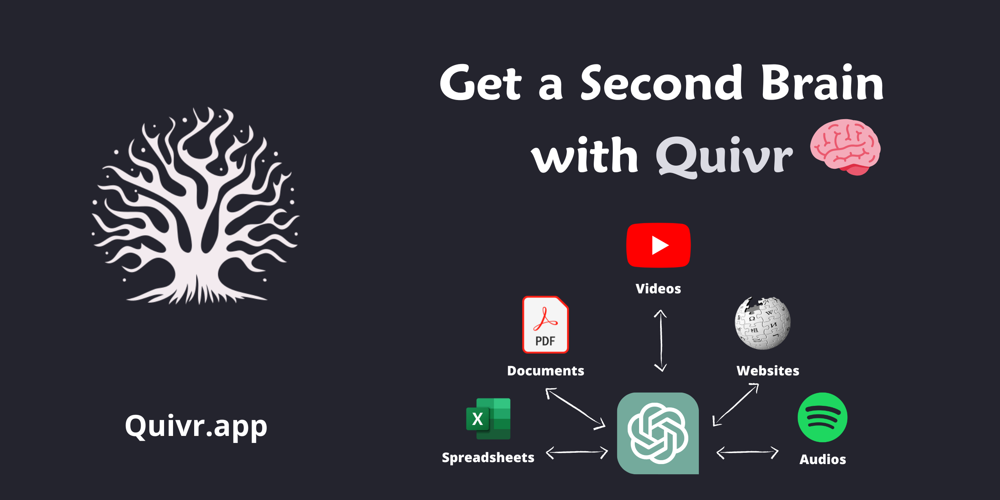

<div align="center">

[](https://quivr.app)

# [Quivr](https://quivr.app)

Open-source RAG Framework

</div>

## Requirements

Building the API client library requires:

1. Java 1.8+
2. Maven (3.8.3+)/Gradle (7.2+)

If you are adding this library to an Android Application or Library:

3. Android 8.0+ (API Level 26+)

## Installation<a id="installation"></a>
<div align="center">
  <a href="https://konfigthis.com/sdk-sign-up?company=Quivr&language=Java">
    
  </a>
</div>

### Maven users

Add this dependency to your project's POM:

```xml
<dependency>
  <groupId>com.konfigthis</groupId>
  <artifactId>quivr-java-sdk</artifactId>
  <version>0.1.0</version>
  <scope>compile</scope>
</dependency>
```

### Gradle users

Add this dependency to your `build.gradle`:

```groovy
// build.gradle
repositories {
  mavenCentral()
}

dependencies {
   implementation "com.konfigthis:quivr-java-sdk:0.1.0"
}
```

### Android users

Make sure your `build.gradle` file as a `minSdk` version of at least 26:
```groovy
// build.gradle
android {
    defaultConfig {
        minSdk 26
    }
}
```

Also make sure your library or application has internet permissions in your `AndroidManifest.xml`:

```xml
<!--AndroidManifest.xml-->
<?xml version="1.0" encoding="utf-8"?>
<manifest xmlns:android="http://schemas.android.com/apk/res/android"
    xmlns:tools="http://schemas.android.com/tools">
    <uses-permission android:name="android.permission.INTERNET"/>
</manifest>
```

### Others

At first generate the JAR by executing:

```shell
mvn clean package
```

Then manually install the following JARs:

* `target/quivr-java-sdk-0.1.0.jar`
* `target/lib/*.jar`

## Getting Started

Please follow the [installation](#installation) instruction and execute the following Java code:

```java
import com.konfigthis.client.ApiClient;
import com.konfigthis.client.ApiException;
import com.konfigthis.client.ApiResponse;
import com.konfigthis.client.Quivr;
import com.konfigthis.client.Configuration;
import com.konfigthis.client.auth.*;
import com.konfigthis.client.model.*;
import com.konfigthis.client.api.ApiKeyApi;
import java.util.List;
import java.util.Map;
import java.util.UUID;

public class Example {
  public static void main(String[] args) {
    Configuration configuration = new Configuration();
    configuration.host = "https://api.quivr.app";
    
    // Configure HTTP bearer authorization: AuthBearer
    configuration.token = "BEARER TOKEN";
    Quivr client = new Quivr(configuration);
    try {
      ApiKey result = client
              .apiKey
              .createNewKey()
              .execute();
      System.out.println(result);
      System.out.println(result.getApiKey());
      System.out.println(result.getKeyId());
      System.out.println(result.getDays());
      System.out.println(result.getOnlyChat());
      System.out.println(result.getName());
      System.out.println(result.getCreationTime());
      System.out.println(result.getIsActive());
    } catch (ApiException e) {
      System.err.println("Exception when calling ApiKeyApi#createNewKey");
      System.err.println("Status code: " + e.getStatusCode());
      System.err.println("Reason: " + e.getResponseBody());
      System.err.println("Response headers: " + e.getResponseHeaders());
      e.printStackTrace();
    }

    // Use .executeWithHttpInfo() to retrieve HTTP Status Code, Headers and Request
    try {
      ApiResponse<ApiKey> response = client
              .apiKey
              .createNewKey()
              .executeWithHttpInfo();
      System.out.println(response.getResponseBody());
      System.out.println(response.getResponseHeaders());
      System.out.println(response.getStatusCode());
      System.out.println(response.getRoundTripTime());
      System.out.println(response.getRequest());
    } catch (ApiException e) {
      System.err.println("Exception when calling ApiKeyApi#createNewKey");
      System.err.println("Status code: " + e.getStatusCode());
      System.err.println("Reason: " + e.getResponseBody());
      System.err.println("Response headers: " + e.getResponseHeaders());
      e.printStackTrace();
    }
  }
}

```

## Documentation for API Endpoints

All URIs are relative to *https://api.quivr.app*

Class | Method | HTTP request | Description
------------ | ------------- | ------------- | -------------
*ApiKeyApi* | [**createNewKey**](docs/ApiKeyApi.md#createNewKey) | **POST** /api-key | Create Api Key
*ApiKeyApi* | [**deleteKey**](docs/ApiKeyApi.md#deleteKey) | **DELETE** /api-key/{key_id} | Delete Api Key
*ApiKeyApi* | [**getList**](docs/ApiKeyApi.md#getList) | **GET** /api-keys | Get Api Keys
*BrainApi* | [**acceptInvitation**](docs/BrainApi.md#acceptInvitation) | **POST** /brains/{brain_id}/subscription/accept | Accept Invitation
*BrainApi* | [**createNewBrain**](docs/BrainApi.md#createNewBrain) | **POST** /brains | Create New Brain
*BrainApi* | [**declineInvitation**](docs/BrainApi.md#declineInvitation) | **POST** /brains/{brain_id}/subscription/decline | Decline Invitation
*BrainApi* | [**getAllForUser**](docs/BrainApi.md#getAllForUser) | **GET** /brains | Retrieve All Brains For User
*BrainApi* | [**getAllPublic**](docs/BrainApi.md#getAllPublic) | **GET** /brains/public | Retrieve Public Brains
*BrainApi* | [**getById**](docs/BrainApi.md#getById) | **GET** /brains/{brain_id} | Retrieve Brain By Id
*BrainApi* | [**getDefaultBrain**](docs/BrainApi.md#getDefaultBrain) | **GET** /brains/default | Retrieve Default Brain
*BrainApi* | [**getDescription**](docs/BrainApi.md#getDescription) | **GET** /brains/integrations | Get Integration Brain Description
*BrainApi* | [**getQuestionContext**](docs/BrainApi.md#getQuestionContext) | **POST** /brains/{brain_id}/documents | Get Question Context For Brain
*BrainApi* | [**getUsers**](docs/BrainApi.md#getUsers) | **GET** /brains/{brain_id}/users | Get Users With Brain Access
*BrainApi* | [**removeUserSubscription**](docs/BrainApi.md#removeUserSubscription) | **DELETE** /brains/{brain_id}/subscription | Remove User Subscription
*BrainApi* | [**setDefault**](docs/BrainApi.md#setDefault) | **POST** /brains/{brain_id}/default | Set Brain As Default
*BrainApi* | [**updateConfiguration**](docs/BrainApi.md#updateConfiguration) | **PUT** /brains/{brain_id} | Update Existing Brain
*BrainApi* | [**updateSecretsValues**](docs/BrainApi.md#updateSecretsValues) | **PUT** /brains/{brain_id}/secrets-values | Update Existing Brain Secrets
*BrainApi* | [**updateSubscription**](docs/BrainApi.md#updateSubscription) | **PUT** /brains/{brain_id}/subscription | Update Brain Subscription
*BrainSubscriptionApi* | [**getUserInvitation**](docs/BrainSubscriptionApi.md#getUserInvitation) | **GET** /brains/{brain_id}/subscription | Get User Invitation
*BrainSubscriptionApi* | [**inviteUsersToBrain**](docs/BrainSubscriptionApi.md#inviteUsersToBrain) | **POST** /brains/{brain_id}/subscription | Invite Users To Brain
*ChatApi* | [**addQuestionAndAnswer**](docs/ChatApi.md#addQuestionAndAnswer) | **POST** /chat/{chat_id}/question/answer | Add Question And Answer Handler
*ChatApi* | [**createHandler**](docs/ChatApi.md#createHandler) | **POST** /chat | Create Chat Handler
*ChatApi* | [**createStreamQuestionHandler**](docs/ChatApi.md#createStreamQuestionHandler) | **POST** /chat/{chat_id}/question/stream | Create Stream Question Handler
*ChatApi* | [**deleteChatById**](docs/ChatApi.md#deleteChatById) | **DELETE** /chat/{chat_id} | Delete Chat
*ChatApi* | [**getAllChats**](docs/ChatApi.md#getAllChats) | **GET** /chat | Get Chats
*ChatApi* | [**getHistory**](docs/ChatApi.md#getHistory) | **GET** /chat/{chat_id}/history | Get Chat History Handler
*ChatApi* | [**handleQuestion**](docs/ChatApi.md#handleQuestion) | **POST** /chat/{chat_id}/question | Create Question Handler
*ChatApi* | [**updateMessage**](docs/ChatApi.md#updateMessage) | **PUT** /chat/{chat_id}/{message_id} | Update Chat Message
*ChatApi* | [**updateMetadataHandler**](docs/ChatApi.md#updateMetadataHandler) | **PUT** /chat/{chat_id}/metadata | Update Chat Metadata Handler
*ContactApi* | [**createNewContact**](docs/ContactApi.md#createNewContact) | **POST** /contact | Post Contact
*CrawlApi* | [**websiteDataProcessor**](docs/CrawlApi.md#websiteDataProcessor) | **POST** /crawl | Crawl Endpoint
*HealthApi* | [**checkStatus**](docs/HealthApi.md#checkStatus) | **GET** /chat/healthz | Healthz
*HealthApi* | [**checkStatus_0**](docs/HealthApi.md#checkStatus_0) | **GET** /crawl/healthz | Healthz
*HealthApi* | [**checkStatus_1**](docs/HealthApi.md#checkStatus_1) | **GET** /healthz | Healthz
*HealthApi* | [**checkStatus_2**](docs/HealthApi.md#checkStatus_2) | **GET** /upload/healthz | Healthz
*KnowledgeApi* | [**deleteSpecificBrainKnowledge**](docs/KnowledgeApi.md#deleteSpecificBrainKnowledge) | **DELETE** /knowledge/{knowledge_id} | Delete Endpoint
*KnowledgeApi* | [**generateSignedUrl**](docs/KnowledgeApi.md#generateSignedUrl) | **GET** /knowledge/{knowledge_id}/signed_download_url | Generate Signed Url Endpoint
*KnowledgeApi* | [**getAllKnowledge**](docs/KnowledgeApi.md#getAllKnowledge) | **GET** /knowledge | List Knowledge In Brain Endpoint
*NotificationApi* | [**getByChatId**](docs/NotificationApi.md#getByChatId) | **GET** /notifications/{chat_id} | Get Notifications
*OnboardingApi* | [**getUserInfo**](docs/OnboardingApi.md#getUserInfo) | **GET** /onboarding | Get User Onboarding Handler
*OnboardingApi* | [**updateUserOnboarding**](docs/OnboardingApi.md#updateUserOnboarding) | **PUT** /onboarding | Update User Onboarding Handler
*PromptApi* | [**createPromptById**](docs/PromptApi.md#createPromptById) | **POST** /prompts | Create Prompt Route
*PromptApi* | [**getAllPublicPrompts**](docs/PromptApi.md#getAllPublicPrompts) | **GET** /prompts | Get Prompts
*PromptApi* | [**getById**](docs/PromptApi.md#getById) | **GET** /prompts/{prompt_id} | Get Prompt
*PromptApi* | [**updateById**](docs/PromptApi.md#updateById) | **PUT** /prompts/{prompt_id} | Update Prompt
*RootApi* | [**statusCheck**](docs/RootApi.md#statusCheck) | **GET** / | Root
*SubscriptionApi* | [**brainHandler**](docs/SubscriptionApi.md#brainHandler) | **POST** /brains/{brain_id}/subscribe | Subscribe To Brain Handler
*SubscriptionApi* | [**unregisterHandler**](docs/SubscriptionApi.md#unregisterHandler) | **POST** /brains/{brain_id}/unsubscribe | Unsubscribe From Brain Handler
*UploadApi* | [**filePost**](docs/UploadApi.md#filePost) | **POST** /upload | Upload File
*UserApi* | [**getIdentityRoute**](docs/UserApi.md#getIdentityRoute) | **GET** /user/identity | Get User Identity Route
*UserApi* | [**getUserInformation**](docs/UserApi.md#getUserInformation) | **GET** /user | Get User Endpoint
*UserApi* | [**updateIdentityRoute**](docs/UserApi.md#updateIdentityRoute) | **PUT** /user/identity | Update User Identity Route


## Documentation for Models

 - [ApiBrainAllowedMethods](docs/ApiBrainAllowedMethods.md)
 - [ApiBrainDefinitionEntityInput](docs/ApiBrainDefinitionEntityInput.md)
 - [ApiBrainDefinitionEntityInputNullable](docs/ApiBrainDefinitionEntityInputNullable.md)
 - [ApiBrainDefinitionEntityOutput](docs/ApiBrainDefinitionEntityOutput.md)
 - [ApiBrainDefinitionEntityOutputNullable](docs/ApiBrainDefinitionEntityOutputNullable.md)
 - [ApiBrainDefinitionSchema](docs/ApiBrainDefinitionSchema.md)
 - [ApiBrainDefinitionSchemaNullable](docs/ApiBrainDefinitionSchemaNullable.md)
 - [ApiBrainDefinitionSchemaProperty](docs/ApiBrainDefinitionSchemaProperty.md)
 - [ApiBrainDefinitionSecret](docs/ApiBrainDefinitionSecret.md)
 - [ApiKey](docs/ApiKey.md)
 - [ApiKeyInfo](docs/ApiKeyInfo.md)
 - [BodyUploadFileUploadPost](docs/BodyUploadFileUploadPost.md)
 - [BrainIntegrationSettings](docs/BrainIntegrationSettings.md)
 - [BrainIntegrationSettingsNullable](docs/BrainIntegrationSettingsNullable.md)
 - [BrainIntegrationUpdateSettings](docs/BrainIntegrationUpdateSettings.md)
 - [BrainIntegrationUpdateSettingsNullable](docs/BrainIntegrationUpdateSettingsNullable.md)
 - [BrainQuestionRequest](docs/BrainQuestionRequest.md)
 - [BrainSubscriptionUpdatableProperties](docs/BrainSubscriptionUpdatableProperties.md)
 - [BrainType](docs/BrainType.md)
 - [BrainTypeNullable](docs/BrainTypeNullable.md)
 - [BrainUpdatableProperties](docs/BrainUpdatableProperties.md)
 - [Chat](docs/Chat.md)
 - [ChatItem](docs/ChatItem.md)
 - [ChatItemType](docs/ChatItemType.md)
 - [ChatMessageProperties](docs/ChatMessageProperties.md)
 - [ChatNullable](docs/ChatNullable.md)
 - [ChatQuestion](docs/ChatQuestion.md)
 - [ChatUpdatableProperties](docs/ChatUpdatableProperties.md)
 - [ContactMessage](docs/ContactMessage.md)
 - [CrawlWebsite](docs/CrawlWebsite.md)
 - [CreateApiBrainDefinition](docs/CreateApiBrainDefinition.md)
 - [CreateApiBrainDefinitionNullable](docs/CreateApiBrainDefinitionNullable.md)
 - [CreateBrainProperties](docs/CreateBrainProperties.md)
 - [CreateChatProperties](docs/CreateChatProperties.md)
 - [CreatePromptProperties](docs/CreatePromptProperties.md)
 - [GCHON](docs/GCHON.md)
 - [GetChatHistoryOutput](docs/GetChatHistoryOutput.md)
 - [IntegrationBrainTag](docs/IntegrationBrainTag.md)
 - [IntegrationDescriptionEntity](docs/IntegrationDescriptionEntity.md)
 - [IntegrationType](docs/IntegrationType.md)
 - [Notification](docs/Notification.md)
 - [NotificationsStatusEnum](docs/NotificationsStatusEnum.md)
 - [OnboardingStates](docs/OnboardingStates.md)
 - [OnboardingStatesNullable](docs/OnboardingStatesNullable.md)
 - [OnboardingUpdatableProperties](docs/OnboardingUpdatableProperties.md)
 - [Prompt](docs/Prompt.md)
 - [PromptNullable](docs/PromptNullable.md)
 - [PromptStatusEnum](docs/PromptStatusEnum.md)
 - [PromptStatusEnumNullable](docs/PromptStatusEnumNullable.md)
 - [PromptUpdatableProperties](docs/PromptUpdatableProperties.md)
 - [PublicBrain](docs/PublicBrain.md)
 - [QuestionAndAnswer](docs/QuestionAndAnswer.md)
 - [UserIdentity](docs/UserIdentity.md)
 - [UserUpdatableProperties](docs/UserUpdatableProperties.md)
 - [ValidationError](docs/ValidationError.md)


## Author
This Java package is automatically generated by [Konfig](https://konfigthis.com)
